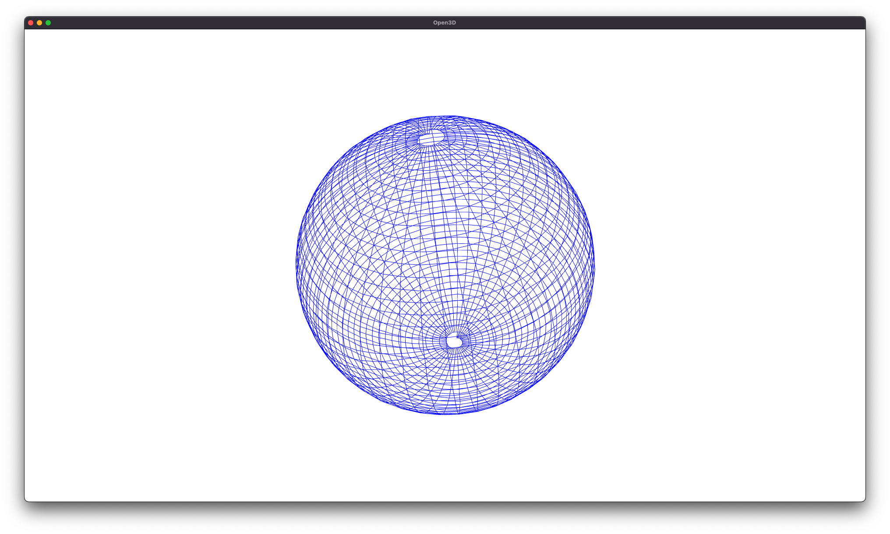

# pgo3d

**[Under Construction]**

Open3D visualization tools for pose graphs.


<p align="center">
  
  
</p>

## Getting started

Install pgo3d locally with
```bash
pip install -e .
```

Now you are ready to use pgo3d.

## Running the examples

